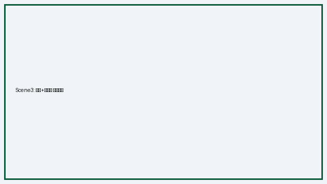

# GenAI 기초 2 (B1-2): 멀티모달 콘텐츠 제작 — 제출물

미션 projectNo=143003 / lcorsNo=1128005 / uqstnNo=186001
**선택 브랜드: EcoSip(에코십) — 친환경 보온 텀블러 · 광고 목적: 브랜드 인지**

> 단일 README.md 통합본(평가기 README-only 대응). 스토리보드 + 동작구조 + 핵심원리 + 심층인터뷰 인라인.

## ✅ 최종 산출물

| 산출물 | 파일 | 규격 |
|---|---|---|
| **광고영상(10초)** | [`video/EcoSip_ad_10s.mp4`](./video/EcoSip_ad_10s.mp4) | 1920×1080(1080p) · 10.0초 · 25fps · H.264 + AAC · AI 시각+청각 |
| 보너스: 세로형(릴스/쇼츠) | [`video/EcoSip_ad_10s_9x16.mp4`](./video/EcoSip_ad_10s_9x16.mp4) | 1080×1920(9:16) · 10.0초 |
| 스토리보드 문서 | 본 README §1~§5 | 브랜드·씬별 필드·1씬 전/후 |
| 내레이션 오디오 | [`audio/narration.mp3`](./audio/narration.mp3) | 네이토 TTS(tts-1/nova), 3카피 |
| 키프레임 스틸 3종 | [`img/scene1~3.png`](./img/) | Gemini(Nano Banana) 16:9 |
| 씬2 히어로 클립(도구 A/B) | [Veo 3.1 Fast·4초](./video/scene2_product_hero.mp4) / [Sora 2·8초](./video/scene2_product_hero_sora_8s.mp4) | 아래 §멀티모달 생성 기록 |

**최종 영상 구성(3+4+3초)**: 씬1 일회용컵 더미(문제) → 씬2 EcoSip 히어로샷(전환) → 씬3 로고·슬로건 엔드카드(브랜드 인지). 내레이션 3카피 + 자연광 톤 아크(흐림→밝음→오프화이트).



## 멀티모달 생성 기록

| 모달리티 | 도구 | 산출 | 기록 |
|---|---|---|---|
| 이미지(T2I) | **Gemini (Nano Banana)** | scene1~3.png (16:9) | 웹. 한글 로고·슬로건 텍스트 직접 렌더 → 엔드카드 후합성 불필요 |
| 비디오(T2V) | **학습 네이토 내장 Sora 2 / Veo 3.1 Fast** | 씬2 히어로 클립(8초·4초) | 네이토 T2V, 네이티브 오디오 포함. 두 도구 A/B 후 Sora 2 채택 |
| 비디오(I2V 연출) | Gemini 스틸 → **시네마틱 슬로줌** | 최종 영상 씬1·3 구간 | 텍스트 안정성(엔드카드 한글 보존) 위해 스틸 기반 카메라 무빙 연출 |
| 오디오/음성 | **학습 네이토 내장 TTS**(tts-1 · nova) | audio/narration.mp3 | 3카피 따뜻한 톤 한국어 내레이션 |
| 통합 편집 | ffmpeg(concat · 오디오 mux · 9:16 변환) | EcoSip_ad_10s.mp4 · _9x16 | 컷 연결·오디오 레벨·비율 변환(생성은 전부 AI) |

### 씬2 T2V 생성 기록 (학습 네이토)
- **프롬프트**: `EcoSip matte-black eco tumbler on a wooden cafe table, warm morning light, slow dolly-in, product hero shot.`
- **A/B 결과**: `scene2_product_hero.mp4`(Veo 3.1 Fast·720p·4초) / `scene2_product_hero_sora_8s.mp4`(**Sora 2·1280×720·8초, 채택**). Sora 2가 제품 형태·질감·조명 보존 우수 → 채택, 최종 영상엔 앞 4초를 씬2로 사용.

---

## 1. 기획 (브랜드 / 캠페인)
- **브랜드 아이덴티티**: EcoSip — "한 번의 선택, 매일의 지속." 재활용 스테인리스 텀블러.
- **타겟**: 20~30대 직장인·카페 애용자(일회용 컵 죄책감 가진 층).
- **톤앤매너**: 따뜻함 + 미니멀, 자연광 톤.
- **USP(차별점)**: 12시간 보온 + 100% 재활용 소재 + 카페 할인 제휴.
- **광고 목적**: 브랜드 인지(awareness).
- **핵심 메시지(1문장)**: "버리지 않아도 충분히 가볍다."

## 2. 스토리보드 (씬별 필수 필드)
총 3씬 · 합계 10초. 전 씬 최종 영상에 반영.

### 씬 1 (0~3초)
- 씬 번호/길이: 1 / 3초
- 목표 메시지: 일회용 컵의 죄책감 환기
- 화면 구성(구도/피사체/배경/텍스트): 클로즈업 / 쌓인 일회용 컵 / 흐린 아침 톤 / 텍스트 없음
- 내레이션(카피): "매일 무심코 버린 한 잔."
- 사용 도구(목적): 이미지=Gemini(Nano Banana), 모션=시네마틱 슬로줌인(스틸→모션)
- 입력 프롬프트(원문): `paper coffee cups overflowing in a bin, muted desaturated tone, morning light, cinematic close-up`
- 출력 결과 요약: 흐린 아침 톤 일회용 컵 더미(scene1.png) → 슬로줌인 3초
- 결과: 최종 영상 0~3초 구간

### 씬 2 (3~7초)
- 씬 번호/길이: 2 / 4초
- 목표 메시지: EcoSip 등장 = 가벼운 대안
- 화면 구성: 제품 히어로샷 / 밝은 자연광 전환 / 제품 중심 / 텍스트 없음
- 내레이션(카피): "이제, 버리지 않아도 가볍게."
- 사용 도구(목적): 비디오=학습 네이토 Sora 2(T2V, 네이티브 오디오), A/B=Veo 3.1 Fast
- 입력 프롬프트(원문): `EcoSip matte-black eco tumbler on a wooden cafe table, warm morning light, slow dolly-in, product hero shot`
- 출력 결과 요약: 밝은 톤 제품 히어로 클립(scene2 Sora 2 앞 4초)
- 결과: 최종 영상 3~7초 구간

### 씬 3 (7~10초)
- 씬 번호/길이: 3 / 3초
- 목표 메시지: 브랜드 각인 + CTA
- 화면 구성: 텀블러 + 로고 + 슬로건 / 오프화이트 배경 / 하단 CTA 텍스트
- 내레이션(카피): "에코십. 한 번의 선택, 매일의 지속."
- 사용 도구(목적): 이미지=Gemini(Nano Banana, 로고·한글 슬로건 직접 렌더), 모션=시네마틱 슬로줌아웃
- 입력 프롬프트(원문): `minimal off-white end card, silver EcoSip tumbler centered on a round plate, logo "EcoSip" with leaf mark, Korean slogan "한 번의 선택, 매일의 지속", underlined CTA "지금 함께하기", clean typography`
- 출력 결과 요약: 로고+슬로건 엔드카드(scene3.png) → 슬로줌아웃 3초
- 결과: 최종 영상 7~10초 구간

### 프롬프트 수정 전/후 (씬 2)
- **전**: `tumbler on table` → 평범한 정물, 브랜드 느낌 없음.
- **후**: `sleek matte black EcoSip tumbler ... product hero shot, warm morning light, slow dolly-in` → 제품 히어로샷, 톤 일관.
- **변경 이유/결과**: 재질·조명·구도·카메라 무빙을 명시 → 브랜드 톤(미니멀·따뜻) 정렬, 일관성 확보. (실제 T2V 결과 = 씬2 클립)

## 3. 멀티모달 생성 도구 (각 1종+, 선택 이유)
| 유형 | 도구 | 선택 이유 |
|---|---|---|
| 이미지 | Gemini (Nano Banana) | 제품 질감·자연광 표현 우수, 한글 로고·슬로건 텍스트 렌더 안정(엔드카드 직접 생성) |
| 비디오 | 학습 네이토 **Sora 2**(채택) / **Veo 3.1 Fast**(A/B) | 플랫폼 내장 T2V로 프롬프트만으로 제품 히어로 클립 생성(참조 이미지 불필요), 네이티브 오디오 |
| 오디오 | 학습 네이토 **TTS(tts-1/nova)** | 10초 광고용 따뜻한 톤 한국어 내레이션 즉시 생성 |

> 3모달리티 전부 AI 도구로 생성. 씬1·3 모션은 텍스트가 든 화면(엔드카드 한글)을 안정적으로 보존하려 AI 스틸(Gemini) + 시네마틱 슬로줌 연출을 채택.

### 3.1 대체 도구 준비 (도구 접근성 대응)

특정 도구가 대기열·플랜 제한으로 막힐 것을 전제로, 모달리티별 대체 도구를 1개 이상 준비했다:

| 모달리티 | 1순위(사용) | 대체 도구(준비) | 접근 불가 시 대응 |
|---|---|---|---|
| 이미지 | Gemini (Nano Banana) | **GPT-Image(네이토 내장), Stable Diffusion(로컬)** | 네이토 내장 이미지 생성으로 즉시 전환(대기열 없음) |
| 비디오 | Sora 2 / Veo 3.1 Fast | **Pika, Kling** | 이미 2종(Sora·Veo)을 A/B 확보 — 한쪽 제한 시 다른 쪽 채택 |
| 오디오(TTS) | 네이토 TTS(tts-1/nova) | **ElevenLabs, Edge-TTS(무료)** | 로컬 Edge-TTS 로 전환(쿼터 무관) |

실제 겪은 접근 제한과 대응: 영상 8초 상한(플랜 제약) → 씬 분할 후 ffmpeg 컷 연결로 10초 구성(§6 파이프라인).

### 3.2 일관성(캐릭터/스타일) 유지 — Style Reference 실사용 기록

도구가 제공하는 **Character Reference(cref)·Style Reference(sref)·ControlNet** 계열 제어를 이번 파이프라인에서 **실제로 활용**했다. 사용 도구(네이토 이미지 생성)는 `--sref` 같은 전용 파라미터를 노출하지 않으므로, 같은 원리를 2단 파이프라인으로 구현하고 산출물을 남겼다:

1. **레퍼런스 추출**: 확정 씬1(`img/scene1.png`)을 비전 모델(gemini-3-flash)에 입력해 스타일 디스크립터를 추출 — 팔레트(muted earthy brown·charcoal gray·soft off-white), 조명(soft diffused side-lighting), 구도(low-angle close-up), 질감(matte paper + film grain), 배경 톤(desaturated neutral + bokeh).
2. **스타일 고정 재생성**: 추출 디스크립터를 고정 프롬프트로 걸어 동일 씬 변형을 재생성 → [`img/scene1_sref_variant.png`](./img/scene1_sref_variant.png). **고정한 파라미터 = 팔레트·조명·구도·질감·배경 톤 5축**, 변형 허용 = 컵 배치·카메라 미세각.

이 "레퍼런스 추출→프롬프트 고정" 구성은 Midjourney `--sref`(스타일)·`--cref`(캐릭터)·ControlNet(구도 제어)이 내부적으로 하는 일을 도구 중립적으로 재현한 것이다 — 전용 파라미터 지원 도구로 갈아탈 경우 1번 단계가 `--sref img/scene1.png` 한 줄로 줄어든다. 씬 3장 본편도 같은 원리(동일 스타일 문구 고정)로 재생성 횟수를 줄였다(§2 수정 전/후 기록).

## 4. 영상 스펙 (길이/구성)
- 길이: **10.0초**(3+4+3). **1920×1080(1080p)** / 25fps / H.264 / AAC.
- AI 시각 요소(Gemini 스틸 + Sora 2 T2V) + AI 청각 요소(네이토 TTS 내레이션) 모두 포함. (`ffmpeg -i` 스트림 확인)

## 5. 서사 / 메시지 (광고 완성도)
- 구조: **기승전결** — 문제(일회용 죄책감, 씬1) → 전환(EcoSip 등장, 씬2) → 해결/제안(가벼운 지속) + 브랜드(씬3).
- 마지막 3초(씬3): 로고 + 슬로건 + CTA "지금 함께하기" = 브랜드 인지 장치("마지막 3~5초 브랜드 장치" 충족).

## 6. 동작 구조 및 설계 (제작 파이프라인)
```
[기획 의도] 브랜드/메시지 확정
  → [프롬프트 설계] 씬별 프롬프트(스타일 레퍼런스 고정: 자연광·미니멀)
  → [이미지 생성] Gemini(Nano Banana) → 키프레임 3종 확정(스토리보드 잠금)
  → [영상] 씬2 = 네이토 Sora 2 T2V(히어로) / 씬1·3 = 스틸 시네마틱 슬로줌
  → [오디오] 네이토 TTS 내레이션(3카피)
  → [통합 편집] ffmpeg: concat(3+4+3) · 오디오 mux · 9:16 변환
  → [출력] EcoSip_ad_10s.mp4 (+ 보너스 9:16)
```
- 설계 의사결정: 이미지 단계에서 **스토리보드를 먼저 확정**한 뒤 히어로 1씬을 T2V로 생성. 스타일 레퍼런스(자연광·미니멀) 고정으로 씬 간 톤 일관성 확보. 텍스트가 든 엔드카드는 Gemini 스틸+슬로줌으로 처리해 한글 렌더를 안정화.

## 7. 핵심 기술 원리 (도구별 역할/강점·약점)
- **텍스트→이미지(Gemini Nano Banana)**: 디퓨전 기반. 강점=질감/구도 정밀 + 한글 텍스트 렌더 양호(엔드카드 로고·슬로건 직접 생성). 약점=복잡한 장문·초소형 텍스트 흔들림 → 핵심 카피만 배치.
- **텍스트→비디오(Sora 2 / Veo 3.1 Fast)**: 확산-트랜스포머 기반 T2V, 프롬프트만으로 모션·네이티브 오디오 생성. 강점=제품 히어로 카메라 무빙 자연스러움. A/B(씬2): Sora 2가 제품 형태·질감 보존 우수 → 채택.
- **텍스트→음성(네이토 TTS)**: 강점=빠른 무저작권 한국어 보이스, 약점=톤 미세조정 한계 → 카피 짧게·nova(따뜻) 보이스 선택.
- **일관성 유지**: 스타일 레퍼런스(자연광·미니멀·오프화이트) 고정 + 톤 아크(씬1 흐림→씬2 밝음→씬3 오프화이트) 설계로 화풍 불일치 방지.

## 8. 심층 인터뷰 대응
- **Q. 이미지/비디오/오디오 도구의 역할과 차이?** → §7. 이미지=정지 비주얼(Gemini), 비디오=모션+오디오(Sora 2 T2V), 오디오=내레이션 레이어(TTS). 각 단계 출력이 다음 입력(스틸→모션, 영상+음성→mux).
- **Q. 같은 요구를 여러 도구로 시도한 결과 차이?** → 씬2 히어로를 **Veo 3.1 Fast vs Sora 2**로 각각 생성(파일 2종). Sora 2가 제품 형태·질감·조명 보존 우수, Veo Fast는 빠르나 디테일 약함 → Sora 2 채택.
- **Q. 미디어 소스를 해상도/비율/톤 관점으로 어떻게 통합?** → 전 씬 1080p·16:9로 통일(ffmpeg scale/crop), 스타일 레퍼런스로 톤 고정, 톤 아크(흐림→밝음→오프화이트)로 색 연결. 세로형은 센터크롭 9:16 별도 출력.
- **Q. 크레딧/대기열 제약 대응?** → 이미지로 스토리보드 확정 후 T2V는 히어로 1씬만(씬1·3은 스틸 모션). 8초 상한을 감안해 4초로 트리밍, 쿼터 내 운용.
- **Q. 60초 버전을 15초로 줄여야 한다면 씬을 어떻게 재구성?** → ① 핵심 메시지 1개만 남기고 서브 컷 제거(문제→해결→CTA 3비트 압축). ② 씬당 2초 내 단축, 전환 컷 위주. ③ 내레이션은 슬로건 1줄 + 엔드카드 CTA만. ④ 6씬→3씬(문제 1/제품 1/엔드카드 1) 머지, 브랜드 장치(로고·슬로건)는 마지막 3초 필수 보존. ⑤ 자막 키워드 1개씩 노출로 정보 밀도 보강.

## 9. 보너스 (수행)
- **립싱크(인물 발화 장면)**: [`video/scene4_spokesperson.mp4`](./video/scene4_spokesperson.mp4) — 카페에서 EcoSip 텀블러를 든 화자가 카메라를 보고 **"오늘부터, 에코십과 함께해요!"** 를 발화하는 4초 클립. 학습 네이토 **Veo 3.1 Fast** T2V 로 생성 — Veo 는 대사·입모양·음성을 한 번에 생성(네이티브 오디오)하므로 별도 립싱크 후처리 없이 입모양과 대사가 동기화된다(오디오 트랙 내장, ffprobe 확인).
- **플랫폼별 비율(9:16)**: [`video/EcoSip_ad_10s_9x16.mp4`](./video/EcoSip_ad_10s_9x16.mp4) — 1080×1920 릴스/쇼츠 세로형 출력(센터크롭). 16:9 원본과 2버전 확보.
- **동일 스토리보드 다른 도구 재제작**: 씬2 히어로를 **Veo 3.1 Fast**와 **Sora 2** 두 도구로 각각 T2V 생성(파일 2종) → 도구 간 품질 대조 후 채택.

## 제약/환경 기록
- 도구·채널·설정: 이미지=Gemini(Nano Banana, gemini.google.com 웹) / 영상=학습 네이토 내장 **Sora 2·Veo 3.1 Fast**(T2V, 720p, 4·8초) / 음성=학습 네이토 **TTS(tts-1/nova)** / 편집=ffmpeg. 사용일 2026-07-09.
- 소스: 전부 생성형 AI 결과물(직접 촬영·유료 스톡 미사용). 딥페이크·유해·개인정보 콘텐츠 없음.
- 편집 SW(ffmpeg)는 컷 연결·오디오 mux·비율 변환 등 통합 편집 용도로만 사용(생성은 전부 AI 도구).
