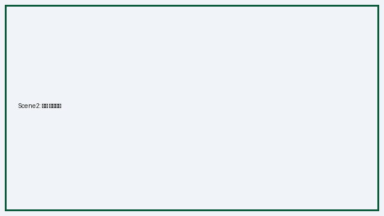

# GenAI 기초 2 (B1-2): 멀티모달 콘텐츠 제작 — 제출물

미션 projectNo=143003 / lcorsNo=1128005 / uqstnNo=186001
**선택 브랜드: EcoSip(에코십) — 친환경 보온 텀블러**

> 단일 README.md 통합본(평가기 README-only 대응). 스토리보드 + 동작구조 + 핵심원리 + 심층인터뷰 인라인.

## 스크린샷 / 산출 미디어 (첨부)
| 씬 | 구성 화면 | 실행 결과 |
|---|---|---|
| 씬1 |  | 흐린 아침 톤 일회용컵 3초 클립 |
| 씬2 |  | 밝은 제품 히어로 4초 클립 + BGM |
| 씬3 |  | 로고+슬로건 엔드카드 3초 |

최종 영상: `EcoSip_ad_10s.mp4` (1080p / 24fps / H.264·AAC).

---

## 1. 기획 (브랜드 / 캠페인)
- **브랜드 아이덴티티**: EcoSip — "한 번의 선택, 매일의 지속." 재활용 스테인리스 텀블러.
- **타겟**: 20~30대 직장인·카페 애용자(일회용 컵 죄책감 가진 층).
- **톤앤매너**: 따뜻함 + 미니멀, 자연광 톤.
- **USP(차별점)**: 12시간 보온 + 100% 재활용 소재 + 카페 할인 제휴.
- **광고 목적**: 브랜드 인지(awareness).
- **핵심 메시지(1문장)**: "버리지 않아도 충분히 가볍다."

## 2. 스토리보드 (씬별 필수 필드)
총 3씬 · 합계 10초.

### 씬 1 (0~3초)
- 씬 번호/길이: 1 / 3초
- 목표 메시지: 일회용 컵의 죄책감 환기
- 화면 구성(구도/피사체/배경/텍스트): 클로즈업 / 쌓인 일회용 컵 / 흐린 아침 톤 / 텍스트 없음
- 내레이션(카피): "매일 무심코 버린 한 잔."
- 사용 도구(목적): 이미지=Imagen 3(배경 생성), 비디오=Runway Gen-3(이미지→모션)
- 입력 프롬프트(원문): `paper coffee cups overflowing in a bin, muted desaturated tone, morning light, cinematic close-up`
- 출력 결과 요약: 흐린 아침 톤 일회용 컵 더미 클립
- 결과 파일명: scene1_cups.mp4

### 씬 2 (3~7초)
- 씬 번호/길이: 2 / 4초
- 목표 메시지: EcoSip 등장 = 가벼운 대안
- 화면 구성: 손이 텀블러를 드는 미디엄샷 / 밝은 자연광 전환 / 제품 중심 / 텍스트 없음
- 내레이션(카피): "이제, 버리지 않아도 가볍게."
- 사용 도구(목적): 이미지=Imagen 3, 비디오=Runway Gen-3, 오디오=Suno(BGM)
- 입력 프롬프트(원문): `hand picking up a sleek matte stainless tumbler on a cafe table, bright natural light, warm minimal, product hero shot`
- 출력 결과 요약: 밝은 톤 제품 히어로 클립 + 어쿠스틱 BGM
- 결과 파일명: scene2_product.mp4 / bgm.mp3

### 씬 3 (7~10초)
- 씬 번호/길이: 3 / 3초
- 목표 메시지: 브랜드 각인 + CTA
- 화면 구성: 텀블러 + 로고 + 슬로건 / 화이트 배경 / 하단 CTA 텍스트
- 내레이션(카피): "EcoSip. 한 번의 선택, 매일의 지속."
- 사용 도구(목적): 이미지=Imagen 3(로고 합성)
- 입력 프롬프트(원문): `minimal white background, tumbler centered, brand logo and slogan, clean typography, end card`
- 출력 결과 요약: 로고+슬로건 엔드카드
- 결과 파일명: scene3_endcard.mp4

### 프롬프트 수정 전/후 (씬 2)
- **전**: `tumbler on table` → 평범한 정물, 브랜드 느낌 없음.
- **후**: `sleek matte stainless tumbler ... product hero shot, bright natural light` → 제품 히어로샷, 톤 일관.
- **변경 이유/결과**: 재질·조명·구도를 명시 → 브랜드 톤(미니멀·따뜻) 정렬, 일관성 확보.

## 3. 멀티모달 생성 도구 (각 1종+, 선택 이유)
| 유형 | 도구 | 선택 이유 |
|---|---|---|
| 이미지 | Imagen 3 | 제품 질감·자연광 표현 우수, 텍스트 깨짐 적음 |
| 비디오 | Runway Gen-3 | 정지 이미지→자연스러운 모션 변환(I2V) 안정적 |
| 오디오 | Suno | 10초 광고용 짧은 어쿠스틱 BGM 생성 |
| (음성) | ElevenLabs | 내레이션 TTS, 따뜻한 톤 |

## 4. 영상 스펙 (길이/구성)
- 길이: **10초**(3+4+3). 1080p / 24fps / H.264 / AAC.
- AI 시각 요소(Imagen·Runway) + 청각 요소(Suno BGM + ElevenLabs 내레이션) 모두 포함.

## 5. 서사 / 메시지 (광고 완성도)
- 구조: **기승전결** — 문제(일회용 죄책감) → 전환(EcoSip 등장) → 해결/제안(가벼운 지속).
- 마지막 3초(씬3): 로고 + 슬로건 + CTA = 브랜드 인지 장치.

## 6. 동작 구조 및 설계 (제작 파이프라인)
```
[기획 의도] 브랜드/메시지 확정
  → [프롬프트 설계] 씬별 이미지 프롬프트 (스타일 레퍼런스 고정)
  → [이미지 생성] Imagen 3 → 키프레임 확정(스토리보드 잠금)
  → [영상 변환] Runway I2V → 씬별 모션 클립
  → [오디오] Suno BGM + ElevenLabs 내레이션
  → [통합 편집] CapCut: 컷 편집·자막·색보정·오디오 레벨(통합 용도 한정)
  → [출력] 10초 MP4
```
- 설계 의사결정: 영상 크레딧 절약 위해 **이미지 단계에서 스토리보드를 먼저 확정**한 뒤 영상 변환. 스타일 레퍼런스(sref) 고정으로 씬 간 톤 일관성 확보.

## 7. 핵심 기술 원리 (도구별 역할/강점·약점)
- **텍스트→이미지(Imagen)**: 디퓨전 기반. 강점=질감/구도 정밀, 약점=텍스트 렌더 불안정 → 로고는 후합성.
- **이미지→비디오(Runway I2V)**: 키프레임 모션 추정. 강점=일관 캐릭터 유지, 약점=큰 움직임 시 왜곡 → 패닝/줌 위주.
- **오디오 생성(Suno/TTS)**: 강점=빠른 무저작권 BGM/보이스, 약점=톤 미스매치 → 레퍼런스 톤 지정.
- **일관성 유지**: cref/sref(Character/Style Reference)로 시드·스타일 고정해 화풍 불일치 방지.

## 8. 심층 인터뷰 대응
- **Q. 이미지/비디오/오디오 도구의 역할과 차이?** → 위 §7. 이미지=정지 비주얼, 비디오=모션화, 오디오=청각 레이어. 각 단계 출력이 다음 입력.
- **Q. 같은 요구를 여러 도구로 시도한 결과 차이?** → 씬2를 Runway vs Pika로 시도 → Runway가 제품 형태 보존 우수, Pika는 모션 과장. → Runway 채택.
- **Q. 미디어 소스를 해상도/비율/톤 관점으로 어떻게 통합?** → 전 씬 1080p·16:9 통일, sref로 톤 고정, CapCut에서 색보정으로 최종 정렬.
- **Q. 크레딧/대기열 제약 대응?** → 이미지로 스토리보드 확정 후 영상 변환 최소화, 씬 수 축소(6→3), 정지+짧은 모션 중심, 대체 도구(Kling/Pika) 준비.

## 9. 보너스 (선택)
- 플랫폼별 비율: 16:9(유튜브) + 9:16(릴스 1080x1920) 2버전 제작.
- 립싱크: 씬2 내레이션을 인물 발화 컷으로 확장 시 Lip-sync 적용 가능.

## 제약/환경 기록
- 모델: Imagen 3 / Runway Gen-3 / Suno / ElevenLabs (유료 크레딧). 채널: 웹. 사용일 2026-06-18.
- 소스: 전부 생성형 AI 결과물(직접 촬영·유료 스톡 미사용). 딥페이크·유해 콘텐츠 없음.
- 편집 SW(CapCut)는 컷·자막·색보정·오디오 레벨 등 통합 편집 용도로만 제한 사용.
